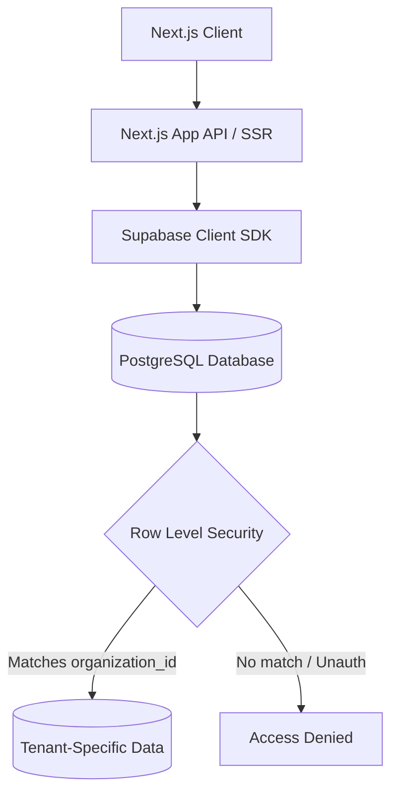

# Nexus Event Ecosystem — System Architecture Guide

This document defines the architectural patterns, security controls, data schemas, and the system components of the Nexus Event Ecosystem.

---

## 1. Multi-Tenant Architecture

Nexus utilizes a **shared-database, logical-isolation multi-tenant architecture**. All tenants (vendor organizations, caterers, studios, etc.) store their records within the same physical PostgreSQL database tables, but data separation is strictly enforced at both the database layer and application routing layer.



### Logical Separation Mechanics:
*   **Tenant Binding Column:** Every workspace-scoped database table contains a mandatory `organization_id` column of type `UUID` referencing `organizations.id`.
*   **Row-Level Security (RLS):** RLS is enabled on all tables in the `public` schema. When an authenticated client makes a query, the PostgreSQL engine validates the transaction against the active session's JWT credentials.
*   **JWT Custom Claims:** The user's metadata contains their active `organization_id`. The RLS policy uses a relational lookup or custom function to verify that the requesting user belongs to the target organization:
    ```sql
    CREATE POLICY "Tenant Isolation Policy" ON leads
    FOR ALL USING (
      organization_id = (
        SELECT organization_id FROM users WHERE id = auth.uid()
      )
    );
    ```

---

## 2. Core Architectural Components

### Organizations
The **Organization** is the primary unit of tenancy representing the business (e.g., a wedding marquee, photography house, or decor studio).
*   **Database Schema:** Managed in the `organizations` table. Fields include `id` (UUID primary key), `name`, `slug` (used for public marketplace routing), `type` (`OrgType` enum: venue, studio, caterer, decorator, etc.), `logo_url`, `plan` (`SubscriptionPlan`), and `settings` (JSON representation of custom business configurations).
*   **Lifecycle:** Created during vendor sign-up. The creator of the organization is automatically assigned the role of `owner`.

### Users
Represent individuals logging into the system. Users may be staff members, administrators, business owners, or end-customers.
*   **Auth vs. Profile Split:** Supabase Auth governs credentials and session tokens inside the isolated `auth.users` system schema. A trigger inserts a corresponding profile row into the `public.users` table upon email confirmation.
*   **Profile Model:** Defined in the `users` table, which includes `id` (primary key matching `auth.users.id`), `organization_id` (null for independent retail customers), `role` (`UserRole`), `full_name`, `email`, `avatar_url`, and `is_active`.

### Roles
Roles govern user hierarchies within an organization and determine administrative boundaries. Available roles are defined in the `UserRole` enum inside [supabase.ts](file:///d:/Nexus-App-Pakistan/src/types/supabase.ts):
1.  `super_admin`: Platform managers. Can access all tenant metrics, change configurations, and bypass billing limits.
2.  `owner`: The creator of the vendor organization. Possesses complete functional access, billing settings, and billing management.
3.  `admin`: Operational leads. Can modify packages, manage staff members, and view reports, but cannot alter subscription payments.
4.  `manager`: Daily operators who handle active client relationships, leads, and scheduling.
5.  `staff`: Field personnel (e.g., second photographers, decorators on-site) who require read access to calendars and gear inventories.
6.  `client`: End customers who access the system to proof photos, review video drafts, and track invoices.

### Permissions
Permissions are granular capability strings formatted as `module:action` (e.g., `leads:create`, `bookings:approve`, `invoices:view`).
*   **Single Source of Truth:** Defined statically inside [roles.ts](file:///d:/Nexus-App-Pakistan/src/lib/rbac/roles.ts) using the `PERMISSIONS` object to allow compile-time safety.
*   **Access Validation:**
    -   *Declarative:* The `<RequirePermission>` component wraps JSX tags. If the user's role lacks the permission, it renders a fallback element or hides the block entirely.
    -   *Imperative:* The `usePermission` React hook provides a `hasPermission` function for button click events and page redirect calculations.

### Modules
Nexus features an dynamic SaaS module model defined in [modules.ts](file:///d:/Nexus-App-Pakistan/src/config/modules.ts).
*   **Module Activation:** Tenants toggle features on and off through the `module_activations` database table. Fields track the activation state and configuration payload for modules like `leads`, `payments`, `accounting`, `projects`, and `equipment`.
*   **Registry Pattern:** The layout imports components dynamically from the `MODULE_REGISTRY` by checking if the module ID is marked active in the tenant's profile and if the current user's role exists in `rolesAllowed`.

### Subscriptions
Enforce payment tiers and resource consumption limits.
*   **Hierarchy:** `free` -> `starter` -> `pro` -> `enterprise`.
*   **Validation Rules:** Handled in [plans.ts](file:///d:/Nexus-App-Pakistan/src/lib/subscriptions/plans.ts). The limits mapping (`PLAN_LIMITS`) dictates maximum user seats, activated modules, storage bytes, and toggles custom features (branding, API access, audit logs, and reports).
*   **Enforcement:** Verified on the client side using the `<RequirePlan>` wrapper, and on the server side via API middleware before executing insert queries (e.g., checking user counts when inviting a new staff member).

### Feature Flags
Enable rolling out experimental or tailored system behaviors.
*   **Database Schema:** Governed by the `feature_flags` table. Toggles have a key, default boolean state, and an optional tenant-specific `organization_id` override.
*   **Use Cases:** Testing new client portals (e.g. AI event schedule planning) with select partner organizations prior to general release.

### Notifications
Keep team members and clients updated on task state changes.
*   **Model:** Tracked in the `notifications` table containing `type` (`lead`, `booking`, `payment`, `message`, `system`, `alert`), `title`, `body`, `link` (redirect URL), and `read` status.
*   **System Dispatch:** Hooked to database triggers or API hooks. The custom hook [useNotifications.ts](file:///d:/Nexus-App-Pakistan/src/lib/notifications/useNotifications.ts) handles local polling, real-time message toasts, and marking items read.

### Messaging
Client-vendor conversational messaging coordinates booking details and package selections.
*   **Channels:** Structured as message threads inside the `messages` table and UI panels like [NexusChat.tsx](file:///d:/Nexus-App-Pakistan/src/components/chat/NexusChat.tsx).
*   **Access Isolation:** Governed by table rules ensuring users can only read messages belonging to threads where their profile ID or organization ID matches the participant keys.

### Audit Logs
Provides a historical, tamper-proof record of workspace operations.
*   **Implementation:** Captured inside the `audit_logs` table via logging helpers defined in [auditLog.ts](file:///d:/Nexus-App-Pakistan/src/lib/audit/auditLog.ts).
*   **Captured Events:** User logins/logouts, workspace settings modifications, role alterations, subscription changes, and module toggles.
*   **No-Op Fail-Safe:** The logging script swallows inner errors (or prints warning logs in development) to guarantee that logging malfunctions never disrupt primary operations like booking creation or payment records.

---

## 3. Technology Stack

Nexus is built using modern, production-grade tools optimizing for quick rendering, relational integrity, and swift deployments:

*   **Next.js App Router (v16.2.7):** Serves as our hybrid application layout manager. Uses React Server Components (RSC) to serve SEO-optimized directories (venues, caterers) and Client Components for dashboard interactions.
*   **TypeScript:** Enforces structural contracts across database returns, API requests, and component properties.
*   **Tailwind CSS (v4):** Used for styles compilation. Declares theme tokens inside custom CSS variables inside [globals.css](file:///d:/Nexus-App-Pakistan/src/app/globals.css) and compiles CSS grids, spacing, and animations efficiently.
*   **Supabase:** Serves as the Backend-as-a-Service, handling user authentication, real-time WebSockets synchronization, secure token exchange, and high-res image CDN storage.
*   **PostgreSQL:** Relational database backing Supabase. Hosts constraints, foreign key cascades, triggers, and Row-Level Security policies.
*   **Vercel:** The deployment platform. Handles edge routing, automatic image optimization caching, and branch deployment setups.
